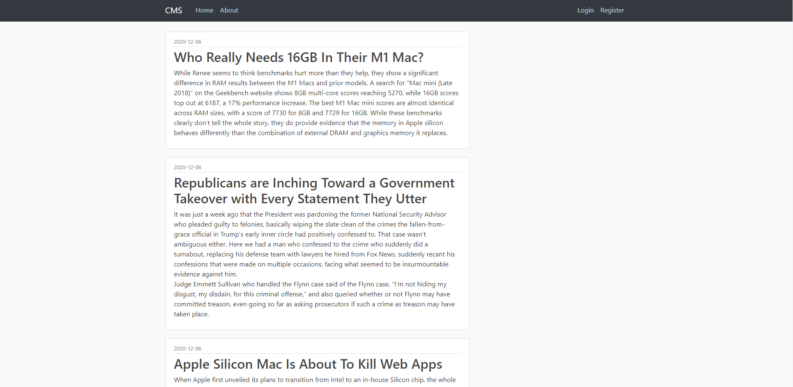
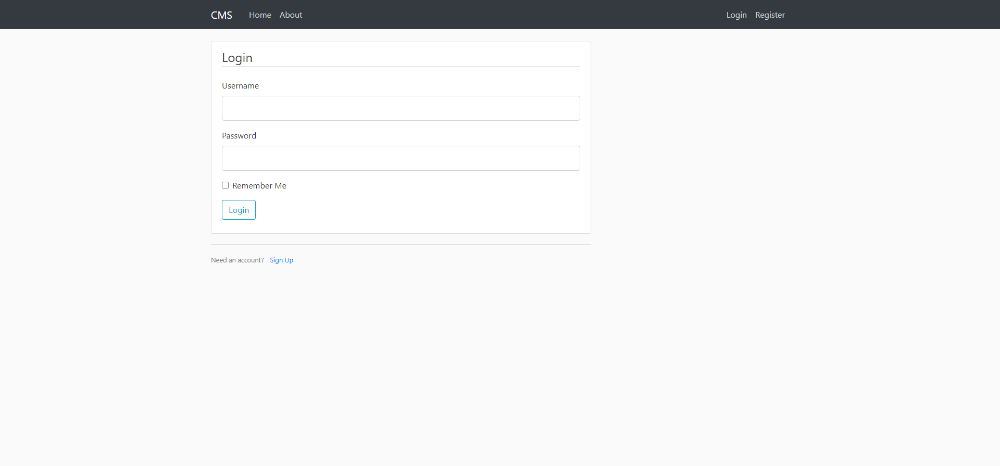
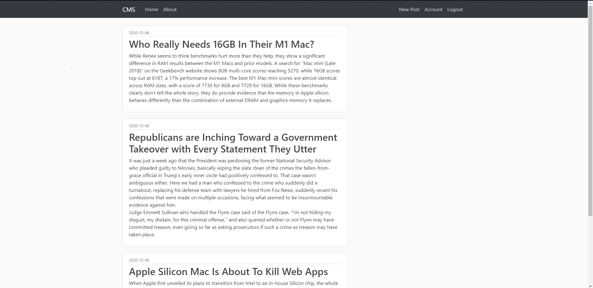
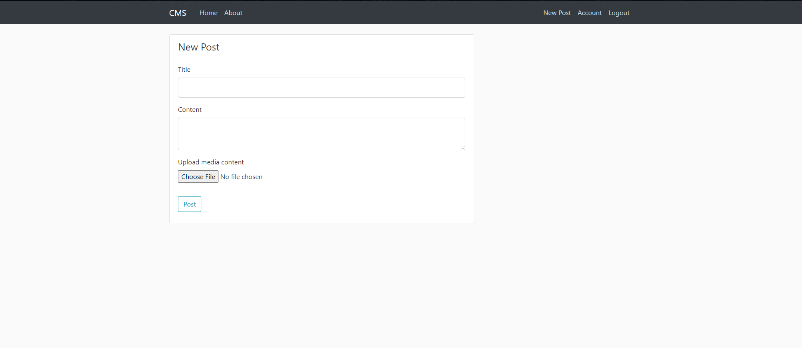
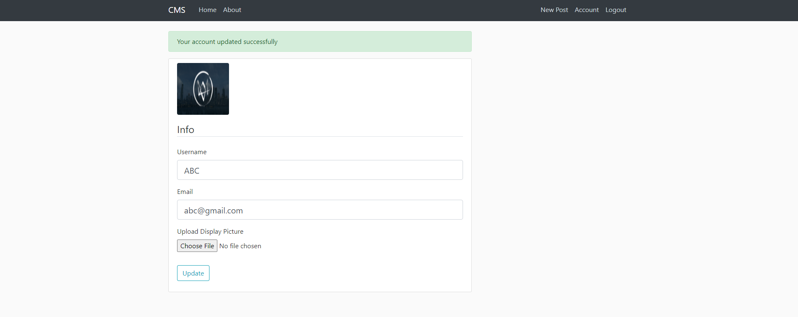
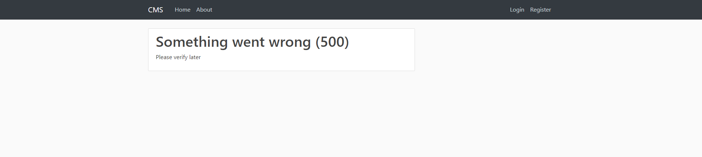

# Content Management Application

Web Application built on Flask framework for content/blogs management

Home page

Registration page

Login page

Logged in home page

New post page

Update account page

Error page

